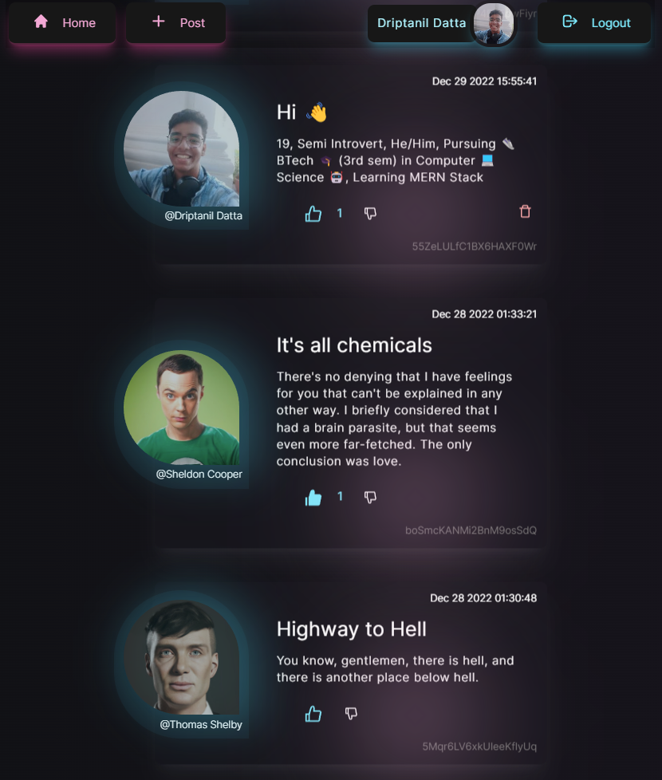
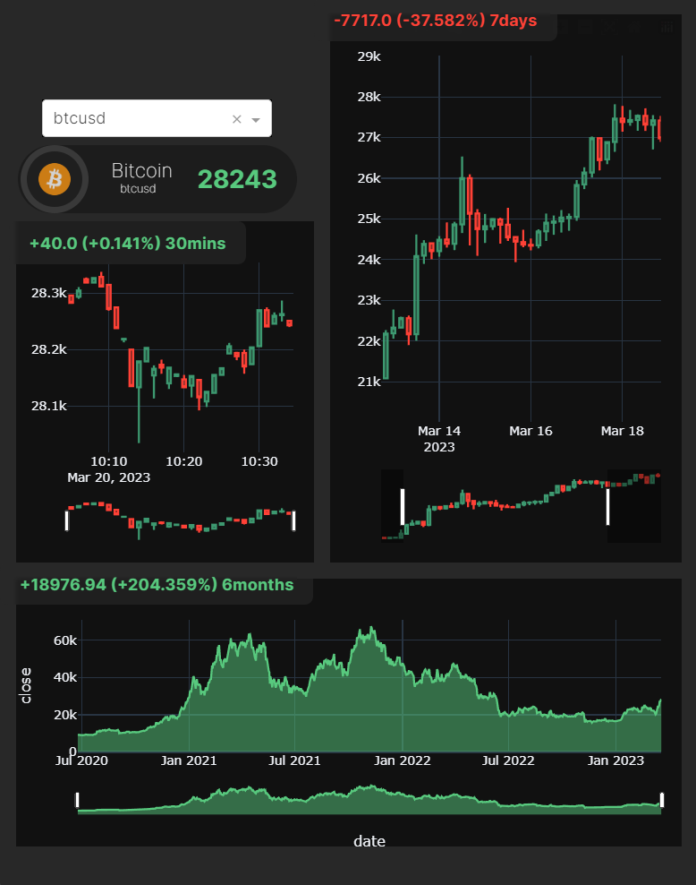
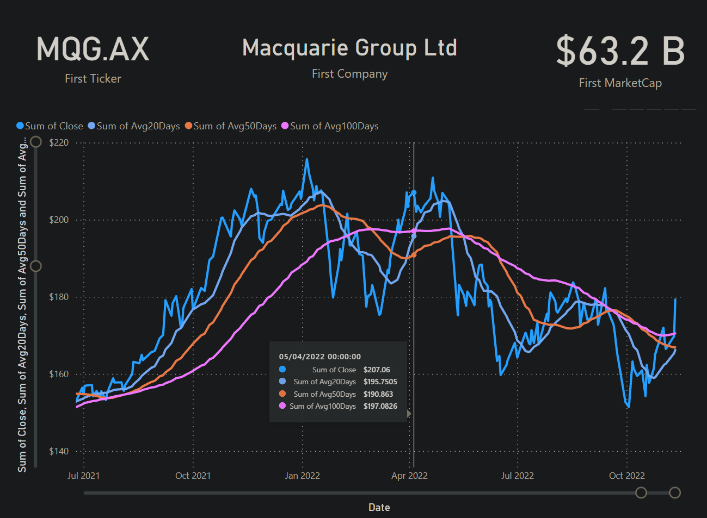

<h1 align="center" >
    👋 Hi, I'm
    <a href="https://driptanil.github.io/" target="_blank"> Driptanil Datta </a> 🤵
</h1>

    A bit about Myself, I am <b>Driptanil</b> pursuing my <b>BTech</b> in <b>Computer Science & Engineering</b> from Techno International New Town, I have acquired knowledge of FrontEnd Web Development As of now, I am learning BackEnd Web Development <b>(Next.JS) </b> but still, wish to explore many fields. ⚡

    
    

    
    
     
     

 
<h3 align="center"> 🤵 My Portfolio 🗃️ : <a href="https://driptanil.github.io/Portfolio/">CLICK HERE</a></h3>
 
 

 
<h1 align="center">🔨 Skills 🤹</h1>
 

    

        
        
        
        
        
        
        
        
        
        
        
        
        
        
        
        
        
        
        
        
    

 
<h1 align="center">🏗️ Projects 🛠</h1>
<!-- REACT -->

<table>
    <tr>
        <td>
            

                 
                <h1 align="center">🌶️Hot 🗨️Takes 🕸️Web📱App</h1>
                 
                <h3>
                        Project Link 🔗 : 
                        <a href="https://social-hot-takes.web.app/">CLICK HERE</a>
                    </h3>
                 
                <li>I learnt React JS from
                    
                    .
                </li>
                 
                <ul>
                    <li> It is Hot Takes sharing app, with features, like
                        <ol>
                            <li> Create New Post
                            <li> Like / Dislike
                            <li> Delete Post
                        </ol>
                    </li>
                     
                    <li>
                        I used <i>`Firebase`</i> for Hosting, NoSQL Database, Google Authentication.
                    </li>
                    <li>
                        I used `TailwindCSS` and `Framer Motion` library to make the UI.
                    </li>
                    <li>
                        I used `yup` package to add restriction to Create Post form.
                    </li>
                     
                     
                    

                        
                        
                        
                        
                        
                        
                        
                        
                        
                    

                </ul>
            

        </td>
        <td>
            
        </td>
    </tr>
</table>
 

<table>
    <tr>
        <td>
            

                 
                <h1 align="center">🎥Live 🪙Crypto 📈Visualizer 🕸️Web📱App</h1>
                 
                <h3>
                        Project Link 🔗 : 
                        <a href="https://crypto-live-visualizer.onrender.com/">CLICK HERE</a>
                    </h3>
                 
                <h3>Features:</h3>
                <ol>
                    <li>
                        Real-time market data
                    </li>
                    <li>
                        Percentage of Profit / Loss of 30 mins, 7 days and 6 months
                    </li>
                    <li>
                        Candle Stick Graph for short term
                    </li>
                    <li>
                        Line Graph for long term
                    </li>
                </ol>
                <h3>Ingredients</h3>
                <ul>
                    <li>
                        <i>`Plotly`</i> and <i>`Dash`</i> library used to create candlestick and line graph visualization.
                    </li>
                    <li>
                        <i>`Render`</i> platform is used to deploy.
                    </li>
                </ul>
                 
                 
                

                    
                    
                    
                    
                    
                    
                    
                    
                

            

        </td>
        <td>
            
        </td>
    </tr>
</table>
 

<table>
    <tr>
        <td>
            

                 
                <h1 align="center">📜Past 💸Stock 💼Market 📔Dashboard</h1>
                 
                <ol>
                    <li>
                        Stock data is fetched from Yahoo Finance and in added to SQL Server Database.
                    </li>
                    <li>
                        I used <i>`Pandas`</i> and <i>`Numpy`</i> to calculate a moving average of 20, 50, 100 days.
                    </li>
                    <li>
                        I used <i>`Microsoft Power BI`</i>, to create dashboard for line graph.
                    </li>
                </ol>
                 
                 
                

                    
                    
                    
                    
                    
                    
                    
                

            

        </td>
        <td>
            
        </td>
    </tr>
</table>
 
<!-- JAVA -->

    <h3>
        
    </h3>
    <li>
        I have learnt Data Structures & Algorithms in Java using concepts like Object Oriented Programming from .
    </li>
    <li>
        I solved problems (stacks, queues, linked lists, trees) on 
    </li>

 
<!--  -->

 

<h1 align="center">🔗 Connect with Me 🤝</h1>
 
 

    <a href="mailto:driprecovery@gmail.com">
    
    
    <!-- <a  href="https://discord.com/users/758681549993541684"> -->
    <!--  -->
    </a>

<table>
    <tr>
        <td>
            
        </td>
        <td>
            
        </td>
    </tr>
</table>

    

        
    

